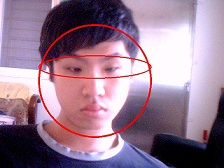

# Open your eyes

## 說明

* 2011年大學時的畢業專題(graduation production)，疲勞駕駛防範之系統(Prevention of fatigue driving)。
* 主體核心以 `opencv` 進行影像辨識，藉以辨識駕駛是否精神不繼
* 使用情境為車載裝置

* 2011年に大学を卒業した頃の卒業制作。疲労運転の防止ためにソフトシステム（車用）
* メインな核心は `opencv` で画像認識しって、そうによって運転手は疲労したかって判断できるようになる

## 概念

* 需拍攝樣本照並計算出樣本疲勞值後，循環拍攝偵測並當判定為疲勞時，發出聲音提醒駕駛
* 原理為二值化後，眼皮、眼白、瞳孔可以計算出眼睛開合的狀態

* 臉部辨識→眼部辨識→灰階(強化對比)→二值化(黑白)→利用白黑比例和自寫演算法得出疲勞值

→
→

## 步驟

* 安裝OpenCVenvsetup資料夾安裝檔 → 執行假虛機專案

**年代久遠，OS或相關環境可能不支援**
